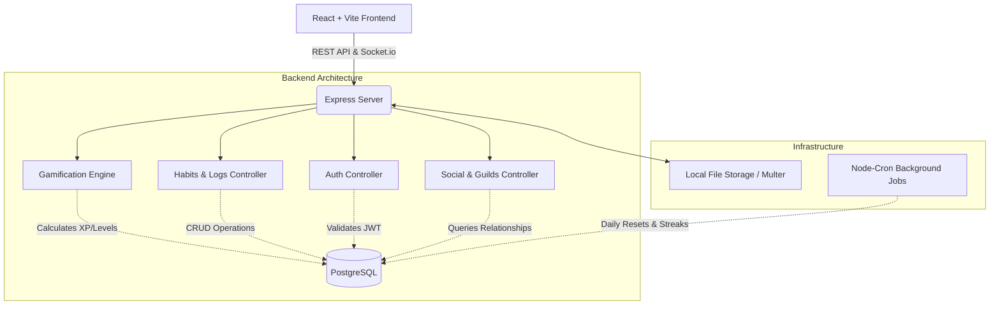
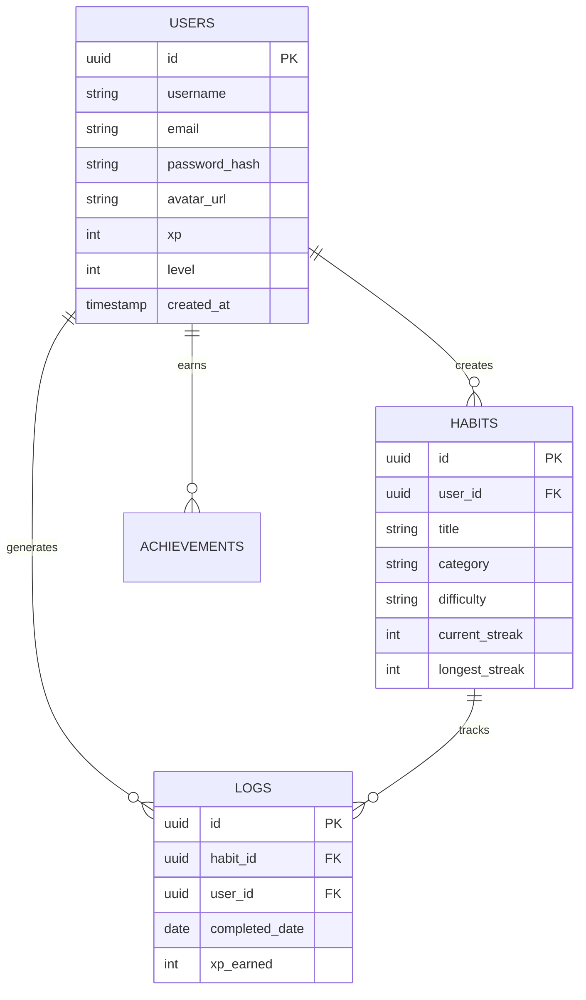

<div align="center">
  
  <h1>HabitForge Pro 🚀</h1>
  <p><em>"Turn Your Life Into An RPG"</em></p>
  
  [](https://reactjs.org/)
  [](https://nodejs.org/)
  [](https://www.postgresql.org/)
  [](https://opensource.org/licenses/MIT)
</div>

<br />

## 📖 Overview

HabitForge Pro is a beautifully gamified, full-stack habit tracking platform designed to turn self-improvement into a highly addictive role-playing game. Moving away from boring checkboxes, HabitForge Pro employs **behavioral psychology, ASMR-like micro-interactions, and deep RPG mechanics** to keep users motivated. 

Whether you are grinding XP to reach Level 50, competing with friends on the global leaderboard, or analyzing your 30-day streak heatmaps, HabitForge Pro is the ultimate productivity companion.

---

## ✨ Comprehensive Feature Suite

### 🎮 RPG Gamification Engine
*   **Dynamic XP System**: Earn experience points based on habit difficulty (Easy, Medium, Hard, Epic) and streak bonuses.
*   **Leveling System**: Progress from Level 1 (Novice) to Level 50 (Grandmaster) with exponentially scaling XP thresholds.
*   **Achievement Badges**: Unlock beautifully designed badges for hitting milestones (e.g., "7-Day Warrior", "Early Bird").

### 📊 Deep Behavioral Analytics
*   **GitHub-Style Heatmap**: Visualize your daily consistency with an interactive 365-day habit grid.
*   **Completion Rate Trends**: Track your success over time with dynamic line and area charts.
*   **Category Spider Charts**: Identify imbalances in your lifestyle (e.g., Health vs. Productivity vs. Mindfulness).
*   **Habit Ranking**: Instantly see your best-performing and most-skipped habits.

### 👥 Social & Multiplayer Mechanics
*   **Guilds & Factions**: Join teams to pool XP and complete massive weekly community challenges.
*   **Friend Leaderboards**: Compete against your peers on the monthly XP leaderboard.
*   **Activity Feed**: Real-time updates when friends level up or achieve rare milestones.

### 🧠 AI Productivity Coach
*   **Personalized Insights**: Get AI-driven feedback analyzing your skip patterns and suggesting optimizations.
*   **Dynamic Habit Generation**: Let the AI suggest realistic micro-habits based on your ultimate goals.

### 🎨 Premium "ASMR" User Experience
*   **Fluid Animations**: Spring-physics powered UI interactions using Framer Motion.
*   **Satisfying Audio**: Subtle, perfectly tuned sound effects on habit completion (via Howler.js).
*   **Profile Customization**: Upload custom avatars, toggle between deep dark/light modes, and customize timezone/start-of-week settings.

---

## 🏗️ System Architecture



---

## 🛠 Tech Stack Details

### Frontend Architecture
*   **Core**: React 18, Vite, React Router DOM
*   **State Management**: Zustand (Global UI/Auth state), TanStack React Query (Server state caching)
*   **Styling**: Tailwind CSS, PostCSS, Custom CSS Variables (Hex-based)
*   **Animations & UI**: Framer Motion, Radix UI Primitives, Lucide React Icons
*   **Data Visualization**: Recharts
*   **Forms & Validation**: React Hook Form, Zod

### Backend Architecture
*   **Core**: Node.js, Express.js
*   **Database**: PostgreSQL (via `pg` native driver, highly optimized raw SQL queries)
*   **Authentication**: JSON Web Tokens (JWT), Bcrypt for password hashing
*   **File Uploads**: Multer (configured for local static serving of user avatars)
*   **Security**: Helmet (Strict CORS/CORP policies bypassed for static assets), express-rate-limit, express-mongo-sanitize
*   **Background Jobs**: Node-Cron (for resetting daily habits and calculating streak penalties at midnight)

---

## 🗄️ Core Database Schema



---

## 🚀 Installation & Setup

### Prerequisites
*   **Node.js**: v18.0.0 or higher
*   **PostgreSQL**: v14 or higher installed and running locally
*   **Git**: For cloning the repository

### 1. Database Initialization
1. Open your PostgreSQL terminal (`psql` or pgAdmin).
2. Create the database and user:
   ```sql
   CREATE DATABASE habitforge_db;
   CREATE USER habitforge_user WITH PASSWORD 'HabitForge_DB_P@ss2026!';
   GRANT ALL PRIVILEGES ON DATABASE habitforge_db TO habitforge_user;
   ```

### 2. Backend Setup
1. Navigate to the backend directory:
   ```bash
   cd backend
   ```
2. Install dependencies:
   ```bash
   npm install
   ```
3. Run the database migration script to generate all required tables and seed initial data:
   ```bash
   npm run migrate
   ```
4. Start the backend development server (runs on `http://localhost:5000`):
   ```bash
   npm run dev
   ```

### 3. Frontend Setup
1. Open a new terminal and navigate to the frontend directory:
   ```bash
   cd frontend
   ```
2. Install dependencies:
   ```bash
   npm install
   ```
3. Start the Vite development server:
   ```bash
   npm run dev
   ```
4. Open your browser and navigate to `http://localhost:5173`.

---

## 🛡️ Security & Deployment Considerations

*   **Hardcoded Configurations**: Per initial development requirements, database configurations and JWT secrets are currently hardcoded in `backend/config/database.js` and `auth` modules. 
    *   ⚠️ **CRITICAL**: Before deploying to a production environment (like Render, Vercel, or AWS), you **MUST** migrate these to environment variables using a `.env` file and `process.env`.
*   **File Storage**: User profile pictures are currently uploaded to the local file system (`backend/uploads/avatars`). For stateless cloud deployments, integrate an S3-compatible bucket or Cloudinary.
*   **Cross-Origin Resource Policy**: Helmet is configured to allow `cross-origin` resource sharing so the frontend can successfully display uploaded static images from the backend server.

---

## 📂 Project Structure

```text
habitforge-pro/
├── backend
|  ├── config
|  |  ├── auth.js
|  |  ├── constants.js
|  |  ├── cors.js
|  |  ├── database.js
|  |  └── rateLimit.js
|  ├── db
|  |  ├── migrate-single.js
|  |  ├── migrate.js
|  |  ├── migrations
|  |  |  ├── 001_create_users.sql
|  |  |  ├── 002_create_habits.sql
|  |  |  ├── 003_create_habit_logs.sql
|  |  |  ├── 004_create_streaks.sql
|  |  |  ├── 005_create_guilds.sql
|  |  |  ├── 005_create_xp_ledger.sql
|  |  |  ├── 006_create_badges.sql
|  |  |  ├── 007_create_user_badges.sql
|  |  |  ├── 008_create_goals.sql
|  |  |  ├── 009_create_reminders.sql
|  |  |  ├── 010_create_friend_links.sql
|  |  |  ├── 011_create_challenges.sql
|  |  |  ├── 012_create_challenge_members.sql
|  |  |  ├── 013_create_notes.sql
|  |  |  ├── 014_create_audit_log.sql
|  |  |  ├── 015_create_indexes.sql
|  |  |  ├── 016_create_habit_templates.sql
|  |  |  └── 017_create_ai_insights.sql
|  |  └── seeds
|  |     ├── seed_badges.sql
|  |     └── seed_default_habits.sql
|  ├── middleware
|  |  ├── authenticate.js
|  |  ├── authorize.js
|  |  ├── errorHandler.js
|  |  ├── rateLimiter.js
|  |  ├── requestLogger.js
|  |  ├── sanitize.js
|  |  ├── upload.js
|  |  └── validate.js
|  ├── modules
|  |  ├── ai
|  |  |  ├── ai.controller.js
|  |  |  ├── ai.routes.js
|  |  |  └── ai.service.js
|  |  ├── analytics
|  |  |  ├── analytics.controller.js
|  |  |  ├── analytics.routes.js
|  |  |  └── analytics.service.js
|  |  ├── auth
|  |  |  ├── auth.controller.js
|  |  |  ├── auth.routes.js
|  |  |  ├── auth.schema.js
|  |  |  └── auth.service.js
|  |  ├── challenges
|  |  |  ├── challenges.routes.js
|  |  |  ├── challenges.schema.js
|  |  |  └── challenges.service.js
|  |  ├── export
|  |  |  ├── export.controller.js
|  |  |  ├── export.routes.js
|  |  |  └── export.service.js
|  |  ├── friends
|  |  |  ├── friends.controller.js
|  |  |  ├── friends.routes.js
|  |  |  └── friends.service.js
|  |  ├── gamification
|  |  |  ├── gamification.controller.js
|  |  |  ├── gamification.engine.js
|  |  |  ├── gamification.routes.js
|  |  |  └── gamification.service.js
|  |  ├── goals
|  |  |  ├── goals.controller.js
|  |  |  ├── goals.routes.js
|  |  |  ├── goals.schema.js
|  |  |  └── goals.service.js
|  |  ├── guilds
|  |  |  ├── guilds.controller.js
|  |  |  ├── guilds.routes.js
|  |  |  └── guilds.service.js
|  |  ├── habits
|  |  |  ├── habits.controller.js
|  |  |  ├── habits.routes.js
|  |  |  ├── habits.schema.js
|  |  |  └── habits.service.js
|  |  ├── logs
|  |  |  ├── logs.controller.js
|  |  |  ├── logs.routes.js
|  |  |  ├── logs.schema.js
|  |  |  └── logs.service.js
|  |  ├── notes
|  |  |  ├── notes.controller.js
|  |  |  ├── notes.routes.js
|  |  |  └── notes.service.js
|  |  ├── reminders
|  |  |  ├── reminderCron.js
|  |  |  ├── reminders.routes.js
|  |  |  ├── reminders.schema.js
|  |  |  └── reminders.service.js
|  |  ├── streaks
|  |  |  ├── streaks.controller.js
|  |  |  ├── streaks.routes.js
|  |  |  └── streaks.service.js
|  |  └── users
|  |     ├── users.controller.js
|  |     ├── users.routes.js
|  |     ├── users.schema.js
|  |     └── users.service.js
|  ├── package-lock.json
|  ├── package.json
|  ├── server.js
|  ├── sockets
|  |  └── socketManager.js
|  ├── uploads
|  |  └── avatars
|  |     
|  └── utils
|     ├── dateHelpers.js
|     ├── logger.js
|     ├── response.js
|     ├── tokenHelpers.js
|     └── xpCalculator.js
├── frontend
|  ├── fill-assets.cjs
|  ├── index.html
|  ├── package-lock.json
|  ├── package.json
|  ├── postcss.config.js
|  ├── public
|  |  ├── favicon.svg
|  |  ├── fonts
|  |  |  ├── Inter-Bold.woff2
|  |  |  └── Inter-Regular.woff2
|  |  ├── mockup.png
|  |  └── sounds
|  |     ├── click.wav
|  |     ├── error.wav
|  |     ├── level_up.wav
|  |     └── success.wav
|  ├── src
|  |  ├── App.jsx
|  |  ├── components
|  |  |  ├── animations
|  |  |  |  ├── CountUpNumber.jsx
|  |  |  |  └── PageTransition.jsx
|  |  |  ├── charts
|  |  |  |  ├── CategoryPieChart.jsx
|  |  |  |  └── CompletionAreaChart.jsx
|  |  |  ├── feedback
|  |  |  |  └── Confetti.jsx
|  |  |  ├── goals
|  |  |  |  └── AddGoalModal.jsx
|  |  |  ├── habits
|  |  |  |  ├── AddHabitModal.jsx
|  |  |  |  └── EditHabitModal.jsx
|  |  |  ├── layout
|  |  |  |  ├── AppLayout.jsx
|  |  |  |  └── TopNav.jsx
|  |  |  ├── profile
|  |  |  |  └── EditProfileModal.jsx
|  |  |  ├── tour
|  |  |  |  └── AppTour.jsx
|  |  |  └── ui
|  |  |     ├── AICoachWidget.jsx
|  |  |     ├── Avatar.jsx
|  |  |     ├── Badge.jsx
|  |  |     ├── Button.jsx
|  |  |     ├── Card.jsx
|  |  |     ├── Checkbox.jsx
|  |  |     ├── ConfirmModal.jsx
|  |  |     ├── CustomSelect.jsx
|  |  |     ├── Dropdown.jsx
|  |  |     ├── Input.jsx
|  |  |     ├── LiveActivityFeed.jsx
|  |  |     ├── Modal.jsx
|  |  |     ├── ProgressBar.jsx
|  |  |     ├── ProgressRing.jsx
|  |  |     ├── Skeleton.jsx
|  |  |     ├── Toggle.jsx
|  |  |     └── Tooltip.jsx
|  |  ├── constants
|  |  |  ├── api.js
|  |  |  └── theme.js
|  |  ├── hooks
|  |  |  ├── useAnalytics.js
|  |  |  ├── useChallenges.js
|  |  |  ├── useFriends.js
|  |  |  ├── useGamification.js
|  |  |  ├── useGoals.js
|  |  |  ├── useHabits.js
|  |  |  ├── useJournal.js
|  |  |  └── useLogs.js
|  |  ├── lib
|  |  |  ├── api.js
|  |  |  ├── auth.js
|  |  |  ├── queryClient.js
|  |  |  └── sound.js
|  |  ├── main.jsx
|  |  ├── pages
|  |  |  ├── Analytics
|  |  |  |  └── AnalyticsPage.jsx
|  |  |  ├── Auth
|  |  |  |  ├── LoginPage.jsx
|  |  |  |  └── RegisterPage.jsx
|  |  |  ├── Challenges
|  |  |  |  └── ChallengesPage.jsx
|  |  |  ├── Dashboard
|  |  |  |  └── DashboardPage.jsx
|  |  |  ├── Export
|  |  |  ├── Friends
|  |  |  |  └── FriendsPage.jsx
|  |  |  ├── Gamification
|  |  |  |  └── GamePage.jsx
|  |  |  ├── Goals
|  |  |  |  └── GoalsPage.jsx
|  |  |  ├── Guilds
|  |  |  |  └── GuildsPage.jsx
|  |  |  ├── HabitGrid
|  |  |  |  └── HabitGridPage.jsx
|  |  |  ├── Habits
|  |  |  |  └── HabitsManagerPage.jsx
|  |  |  ├── Journal
|  |  |  |  └── JournalPage.jsx
|  |  |  ├── Landing
|  |  |  |  └── LandingPage.jsx
|  |  |  ├── Profile
|  |  |  |  └── ProfilePage.jsx
|  |  |  ├── PublicInfo
|  |  |  |  ├── FeaturesPage.jsx
|  |  |  |  ├── PricingPage.jsx
|  |  |  |  ├── PrivacyPage.jsx
|  |  |  |  └── TermsPage.jsx
|  |  |  └── Settings
|  |  |     └── SettingsPage.jsx
|  |  ├── router
|  |  |  ├── index.jsx
|  |  |  └── ProtectedRoute.jsx
|  |  ├── store
|  |  |  ├── authStore.js
|  |  |  ├── socketStore.js
|  |  |  └── uiStore.js
|  |  ├── styles
|  |  |  ├── animations.css
|  |  |  ├── globals.css
|  |  |  └── scrollbar.css
|  |  └── utils
|  |     ├── cn.js
|  |     └── formatters.js
|  ├── tailwind.config.js
|  └── vite.config.js
├── package-lock.json
├── package.json
└── README.md
```

---

## 🤝 Contributing
Contributions are always welcome! Whether it's adding new gamification mechanics, optimizing the React Query cache, or fixing UI bugs, please feel free to submit a Pull Request.

## 📄 License
This project is licensed under the MIT License. See the `LICENSE` file for details.
